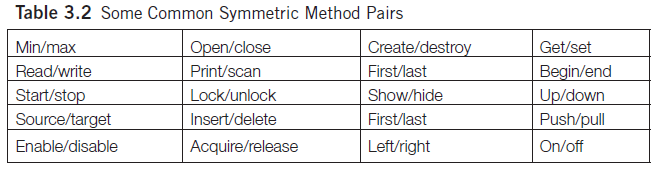

# Incomplete Abstraction

Smell ini terjadi ketika ada sebuah method yang secara logika harusnya punya pasangan, namun karena belum ada requirement, developer belum membuat pasangannya.

Contoh pasangan di buku Girish:



## Contoh

## Masalah

Terdapat method `setAuthor()` di dalam class <github-url to="before/Book.java">Book</github-url>.

Tentunya class ini terlihat aneh karena hanya ada fungsi setter tanpa getter (atau behavior lain yang memanfaatkan string author). Kita tidak pernah mendengar ada [Compact Disc](https://en.wikipedia.org/wiki/Compact_disc) yang write-only, bukan?

<Tabs>
<Tab name="Book" text="Book.java">

```java
public class Book {
	//...

	private String author;

	public void setAuthor(String author) {
		this.author = author;
	}

	public String getAuthor() {
		return author;
	}

	//...
}
```

</Tab>
</Tabs>

## Penyelesaian

Dilengkapi dengan menambahkan `getAuthor()`.

---

Contoh lain yang menarik, Suryanarayana et al. mempermasalahkan code di dalam Java: interface [javax.swing.ButtonModel](https://docs.oracle.com/javase/7/docs/api/javax/swing/ButtonModel.html).

Perhatikan methods yang disediakan pada interface ButtonModel. Semuanya berpasangan, misal `setPressed()` berpasangan dengan `isPressed()`. Namun, terdapat method `setGroup()` tidak memiliki pasangan.

Pasangan `setGroup` malah dibuat di class turunannya: [javax.swing.DefaultButtonModel](https://docs.oracle.com/javase/7/docs/api/javax/swing/DefaultButtonModel.html). Terdapat method `getGroup` di class tersebut.

Hal ini aneh, karena idealnya, bila memang kelupaan, `getGroup` langsung ditambahkan di dalam interface ButtonModel. Ini malah dipaksa diselipkan di class turunannya.

Hal ini terpaksa dilakukan Java karena bila mereka menambahkan `getGroup` di interface yang sudah terlanjur di-publish, maka semua programmer yang sedang menggunakan versi Java tersebut akan kalang kabut karena terjadi major changes (major version harus ditambahkan). Biasanya software atau library memiliki versioning setidaknya tiga angka dengan format `major.minor.patch`. Contoh: `1.0.5`. Silakan pelajari perkara versioning lebih detail di [semver.org](https://semver.org/).

## When to Ignore

Bukan termasuk smell bila memang developer **sengaja** menghilangkan pasangannya.

Contohnya, class memang sengaja dibuat hanya punya getter tanpa setter karena atribut read-only.

Contoh lain, pada Java, class dibuat hanya punya constructor saja tanpa destructor karena di Java sudah ada fitur garbage collector. Berbeda bila kita menggunakan bahasa C++, destructor harus dibuat (dan dipanggil) manual.
