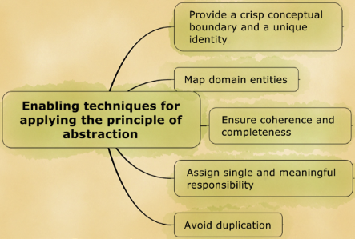

# Abstraction

Semua smell di dalam grup ini berkaitan dengan kesalahan dalam mendesain abstraksi.

- [Missing Abstraction](missing/)
- [Imperative Abstraction](imperative/)
- [Incomplete Abstraction](incomplete/)
- [Multifaceted Abstraction](multifaceted/)
- [Unnecessary Abstraction](unnecessary/)
- [Unutilized Abstraction](unutilized/)
- [Duplicate Abstraction](duplicate/)

## Prinsip abstraction

Menurut Girish Suryanarayana dkk, terdapat 5 prinsip abstraction yaitu:

- **Provide a crisp conceptual boundary and an identity** - Adanya boundary yang jelas.
- **Map domain entities** - Pemilihan kata yang tepat terhadap domain.
- **Ensure coherence and completeness** - Berikan detail kelas yang selengkap-lengkapnya dan koheren (termasuk pasangan/lawan kata).
- **Assign single and meaningful responsibility** - Hanya memegang 1 tanggungjawab penting dalam 1 class.
- **Avoid duplication** - Hindari duplikat nama atau implementasi dalam abstraksi.

Berdasarkan pada pengamatan abstraction smell, terdapat pelanggaran prinsip abstraction antara lain:

| Abstraction smell | Pelanggaran prinsip abstraction | Penyebab | Martin Fowler smells |
| --- | --- | --- | --- |
| Missing Abstraction | Provide a crisp conceptual boundary and a unique identity | Pemakaian komponen-komponen data/string tanpa membuatkan object class | Primitive Obsession, Data Clumps |
| Imperative Abstraction | Map domain entities | Proses dijadikan class, pemikiran Procedural dalam Object-oriented programming | Lazy Class *(Potentially)* |
| Incomplete Abstraction | Ensure coherence and completeness | Tidak ada pasang/lawan kata domain | - |
| Multifaceted Abstraction | Assign single and meaningful responsibility | Satu class memegang > 1 tanggungjawab | Divergent Changes + Large Class |
| Unnecessary Abstraction | Assign single and meaningful responsibility | Pembuatan class yang seharusnya tidak diperlukan (alias overengineering) | Speculative Generalities |
| Unutilized Abstraction | Assign single and meaningful responsibility | Ada class yang tidak terpakai sama sekali | Dead Code |
| Duplicate Abstraction | Avoid duplication | Ada method/implementasi yang sama antar class | Alternative Classes with Different Interfaces |

---

Repository ini hanyalah rangkuman dari buku Suryanarayana et al. dengan sedikit tambahan informasi lain. Diharapkan mahasiswa juga membaca sumber aslinya pada bab 3 halaman 21 - 60.
