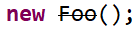

# Unutilized Abstraction

Smell ini terjadi ketika ada class atau interface yang tidak pernah digunakan di dalam project. Smell ini mirip dengan dead code Martin Fowler.

Suryanarayana et al. menggolongkannya dalam dua jenis:

- Unreferenced abstractions: concrete class yang tidak pernah dipakai.
- Orphan abstractions: interface/abstract class yang tidak pernah diturunkan.

## Penyebab Smell

- **Speculative design**: sama dengan Martin Fowler speculative generality. Developer membuatnya karena spekulasi fitur di masa yang akan datang yang tidak pasti kejadian.
- **Leftover Garbage**: awalnya class masih dipakai. Tapi ternyata setelah beberapa kali mengalami refactoring (untuk mengatasi smell lain), developer tidak menyadari class sudah tidak dipakai lagi.
- **Fear of breaking code**: developer takut menghapus class karena khawatir akan masih dipakai.

## Penyelesaian

Class/interface dihapus.

Untuk kasus public library/framework yang belum mau dinaikkan major version-nya (karena menghapus class = breaking changes), maka Anda bisa menandai class/interface itu sebagai `deprecated`. Dengan menandai `deprecated`, Anda memperingatkan developer lain yang menggunakan library ini, bahwa bagian code tersebut akan dihapus di versi yang akan mendatang.

Di Java, cara menandai `deprecated` adalah tinggal menggunakan annotation `@Deprecated`. Contoh:

```java
@Deprecated
public class Foo {

}
```

Bila menggunakan Eclipse IDE, code yang sudah ditandai `deprecated` akan diberi tanda coret.




## Tambahan

Flag `deprecated` tidak hanya berlaku untuk smell ini saja. `Deprecated` bisa Anda manfaatkan ketika belum mau melakukan major breaking changes untuk refactoring smell apapun.
