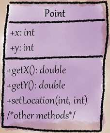

# Deficient Encapsulation


<div class="video-wrapper">
<iframe width="560" height="315" src="https://www.youtube.com/embed/r-wphP9hQ8E" title="YouTube video player" frameborder="0" allow="accelerometer; autoplay; clipboard-write; encrypted-media; gyroscope; picture-in-picture" allowfullscreen></iframe>
</div>


Di bahasa pemrograman Java, terdapat 4 level access modifier yang tentunya berperan sangat penting dalam membatasi akses data yaitu:

- **`private`** untuk akses dalam class saja, biasanya untuk perihal detail dan implementasi class/method.
- **`(package)`** untuk akses dari package yang sama, biasanya untuk perihal implementasi dalam satuan package.
- **`protected`** untuk akses dari package yang sama dan subclass yang di-*extend*, biasanya untuk perihal yang terpakai dalam subclass.
- **`public`** untuk akses dari mana saja, biasanya untuk perihal yang dipakai/diakses secara luas.

Penggunaan access modifier yang tidak sesuai pada konteks dapat menimbulkan smell yang fatal jika sampai terakses ataupun termodifikasi detail membernya. Smell ini terjadi ketika:

- Ada member yang memiliki access modifier yang permissive, terutama jika member tersebut dapat diakses oleh abstraksi mana saja (mirip [Inappropriate Intimacy](../../../martin-fowler/couplers/inappropriate-intimacy/)).
- Member class / abstraksi / hierarki dapat mengakses field tanpa setter getter.

Jika dibiarkan dapat berpotensi adanya pembocoran data yang tidak terduga.

## Penyebab Smell

- **Easier testability**: Dimana developer ingin menguji private method dengan mengubah access modifier `private` ke `public` yang seharusnya tidak diperbolehkan dalam testing, sehingga dapat terekspos oleh class lain.
- **Procedural thinking in object oriented context**: Adanya perbedaan paham dari Procedural Programmer terhadap global variabel dimana data member diekspos untuk keperluan akses oleh multiple abstractions.
- **Quick-fix solutions**: Developer menggunakan jalan pintas agar permasalahan dapat diselesaikan secepat mungkin seiring dengan deadline project dengan mengekspos member secara global padahal hanya untuk beberapa abstraksi saja.

## Contoh A: `java.awt.Point` dan `java.swing.text.SizeRequirements`

## Masalah



Dalam kasus `java.awt.Point`, terdapat 2 member variabel yang menggunakan access modifier public (yaitu `x` dan `y`) padahal sudah disertakan setter getter. Meski demikian, kasus tersebut tidak bisa direfactor paksa karena kasus tersebut tentunya berpengaruh besar terhadap developer-developer Java.

```java
/** The alignment, specified as a value between 0.0 and 1.0,
inclusive. To specify centering, the alignment should be 0.5. */
public float alignment;
```

Selain kasus `java.awt.Point`, terdapat juga class <github-url to="before/SizeRequirement.java">SizeRequirements</github-url> dari package `java.swing.text` dimana pada variabel `alignment` dapat diakses dan diset nilainya langsung kepada variabel tersebut tanpa harus melalui validasi. Hal ini tentunya menimbulkan dampak fatal jika ada developer dengan \*sengaja\* menginput nilai sembarang.

## Penyelesaian

Pada kasus yang riil, inputan lebih dari 1.0 dianggap variabel yang illegal sehingga perlu direfactor dengan mengubah access modifier `alignment` menjadi private, dan menambahkan method setter *(accessor)* dengan validasi dan getter *(mutator)*.

```java
/** The alignment, specified as a value between 0.0 and 1.0,
inclusive. To specify centering, the alignment should be 0.5. */
private float alignment;

public void setAlignment(float alignment) {
  if(alignment < 0 || alignment > 1) {
    throw new IllegalArgumentException("alignment must be between 0.0 and 1.0");
  }
  this.alignment = alignment;
}

public float getAlignment() {
  return alignment;
}
```

Hasilnya dalam package <github-url to="before/SizeRequirement.java">after</github-url> ketika user ingin melakukan input angka float alignment, user hanya bisa menginput alignment dari 0 hingga 1 sehingga menghindari adanya variable value mismatches dari variabel `alignment`.

## Contoh B: Testing private methods

## Masalah

```java
public class Foo {
  // aslinya private method, diubah jadi public untuk testing
  private int bar() {
    return 2;
  }
}

class FooTest {
  @Test
  void test() {
    Foo f = new Foo();
    assertEquals(2, f.bar());
  }
}
```

Dalam kasus B, disebutkan bahwa developer ingin menguji private method dengan mengubah access modifier `private` ke `public`. Hal ini memang ada maksud baik untuk mempermudah testing, padahal hal seperti itu dilarang keras dalam praktek Testing karena dapat membocorkan akses member ke abstraction lain. Fatalnya, abstraction lain dapat mempermainkan private method sesuka hati tanpa harus melakukan *message chaining* antar method abstraction dan berdampak fatal secara sistematis.

## Penyelesaian

Salah satu jalan pintas untuk testing private method adalah dengan menggunakan teknik **_Reflector_** dalam package `java.lang.reflect` dimana method diubah accessnya untuk keperluan testing pada contoh [test class](testing_using_reflection/FooTest.java) atau secara syntaxnya:
```java
try {
  Method bar = f.getClass().getDeclaredMethod("bar", null);
  bar.setAccessible(true);
  Object result = bar.invoke(f, null);
  assertEquals(2, result);
} catch(Exception e) {
  fail(e);
}
```

Solusi tersebut merupakan salah satu cara agar private class tersebut dapat di-test dalam bahasa pemrograman Java.

## When to Ignore

- Jika global member tersebut dibuat dalam nested class atau anonymous class dimana member tersebut diakses kepada class tuan-nya.
- Class tersebut dipakai untuk meningkatkan performa dan efisiensi dengan mengakses field langsung daripada melalui setter getter.

## Julukan / Nama lain

- **Hideable public attributes/methods**: Method/attribut global dapat disembunyikan
- **Unencapsulated class**: Class dibiarkan terekspos
- **Class with unparameterized methods**: Method tanpa parameter
