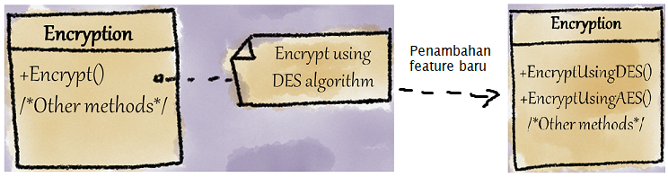

# Missing Encapsulation

<div class="video-wrapper">
<iframe width="560" height="315" src="https://www.youtube.com/embed/tHKGrugra70" title="YouTube video player" frameborder="0" allow="accelerometer; autoplay; clipboard-write; encrypted-media; gyroscope; picture-in-picture" allowfullscreen></iframe>
</div>

Smell ini terjadi bila variabel tersebut tidak terenkapsulasi dalam abstraksi/hierarki. Perlu diwaspadai jika smell ini juga dapat menimbulkan ledakan class jika smell ini terjadi pada hierarki yang bercabang-cabang ataupun hierarki 'bucin' dikarenakan adanya penambahan variasi baru dalam hierarki. Smell ini juga disamaratakan dengan Divergent Changes pada class dan Parallel Inheritence pada hierarki.

## Penyebab

- **Lack of awareness of changing concerns**: Developer takut enkapsulasi bocor bila ada perubahan pada requirement.
- **Lack of refactoring**: Code terlalu jorok, bisa menimbulkan ledakan class jika tidak segera ditangani.
- **Mixing up concerns**: Class, kebutuhan, dan variasi dicampuradukkan dalam 1 hierarki.
- **Naive design decisions**: Merancang class untuk mewakili variasi-variasinya.

## Contoh

## Permasalahan



Misal dalam package before, class <github-url to="before/Encryption.java">Encryption</github-url> berisikan implementasi dan variasi yang dimuatkan bersamaan dalam satu abstraksi. Hal ini tentunya tidak baik jika terjadi perubahan atau penambahan variasi baru dalam class tersebut sehingga menimbulkan [Divergent Changes](../../../martin-fowler/change-preventers/divergent-change/).

## Penyelesaian

**Opsi 1: Gunakan Inheritence**, dimana pada class [Encryption] semua class implementasi dipecahkan ke masing-masing class baru dengan pemakaian abstract method `encrypt()`. Opsi ini sangat berguna bila terdapat penambahan class baru dari hierarki abstraksi yang sudah ada.

```java
Encryption encryption = new DES();
encryption.encrypt();
```

Selain itu, dalam pembuatan Object juga terfasilitasi enkapsulasi karena user cukup membuat object tergantung pada variasi yang dipilih oleh user

**Opsi 2: Gunakan [Strategy Pattern](https://refactoring.guru/design-patterns/strategy)**, dimana pada class [Encryption] diimplementasikan dengan interface [EncryptionAlgorithm] sehingga dalam class Encryption dapat disesuaikan algoritma yang diinginkan dalam enkripsi tersebut.

```java
Encryption encryption = new Encryption(new AES());
encryption.encrypt();
```

Dengan pemakaian Strategy Pattern, user dapat menentukan sendiri algoritma yang dipakai dalam Encryption. Selain itu, Class EncryptionAlgorithm juga tentunya dapat digunakan kembali dalam class lain jika diinginkan.

## Julukan

- **Nested generalization**: Ada banyak kombinasi yang terjadi karena generalisasi pada suatu hierarki.
- **Class explosion**: Ledakan class karena banyaknya variasi dan generalisasi dalam satu hierarki.
- **Combinatorial explosion**: Ledakan class karena adanya penambahan variasi baru sehingga harus menambahkan class-class pendukung dalam hierarki.
