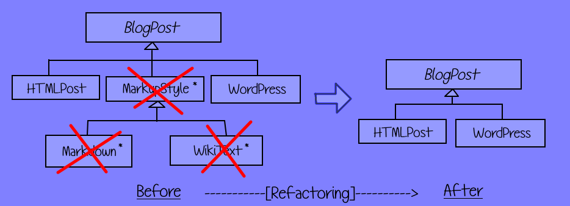

# Speculative Hierarchy

<iframe width="560" height="315" src="https://www.youtube.com/embed/WaI-tpREgd8" title="YouTube video player" frameborder="0" allow="accelerometer; autoplay; clipboard-write; encrypted-media; gyroscope; picture-in-picture" allowfullscreen></iframe>

Smell ini terjadi terdapat beberapa class dalam hierarki yang dibuat karena alasan spekulatif, alias adanya class yang dibuat untuk keperluan sewaktu-waktu fitur tersebut akan ada di waktu yang akan mendatang (dimana terdapat beberapa requirement yang dibuat atas imajinasi developer sendiri). Smell ini tentunya sama dengan smell [Speculative Generalities](/martin-fowler/dispensables/speculative-generality/).

Salah satu prinsip extreme programming (XP) yang terkenal adalah [You aren't gonna need it (YAGNI)](https://en.wikipedia.org/wiki/You_aren%27t_gonna_need_it). Disarankan oleh XP untuk tidak menambahkan fungsionalitas sampai benar-benar diperlukan.

Smell ini tentunya melanggar prinsip YAGNI (“You Ain’t Gonna Need It”) yang seumur-umur tidak akan pernah terpakai apalagi diperlukan dalam requirement.

## Penyebab

- **Future-proofing**: Developer terlalu prediktif dengan pembuatan software yang dapat mengakomodir penggunaan class-class yang terpakai di waktu yang akan datang.
- **Over-engineering**: Developer terlalu nafsu melakukan generalisasi dimana kasus tersebut seharusnya tidak diperlukan dalam requirement.

## Penyelesaian

Jalan paling cepat dalam menyelesaikan speculative hierarchy adalah dengan [Collapse Hierarchy](https://sourcemaking.com/refactoring/collapse-hierarchy) dimana class dan hierarki yang terindikasi spekulatif dibuang dan jika ada hierarki yang terpakai digabungkan dengan hierarki utama.

## Contoh 1: Blogging Annotation speculatives

Misal dalam pembuatan software berbasis web yang dapat mengakomodir pembuatan blog, terdapat 2 jenis anotasi blog yang dapat dilakukan dalam melakukan blogging yaitu `HTML`, `Wordpress style` yang tentunya tertulis dalam requirement.

Pada mula-mulanya, developer menyajikan kedua fitur tersebut dalam implementasi pembuatan post namun lama kelamaan, developer meramal akan ada anotasi baru dalam melakukan blogging yaitu `Markdown` dan `Wiki markup` sehingga developer membuatkan class spekulatif ke dalam hierarki, tak lupa dengan intermediate classnya, `MarkupStyle` untuk mengakomodir kebutuhan markup languages (bertanda bintang).

Lama kelamaan, ramalan markup dalam blogging tersebut ternyata belum pernah terjadi dan terabaikan begitu saja hingga sekarang dan akhirnya, smell Speculative Hierarchy malah terjadi karena adanya class yang dipersiapkan untuk keperluan di masa yang akan mendatang namun tidak pernah terpakai sama sekali.

Sebagai gantinya, lakukan [Collapse Hierarchy](https://sourcemaking.com/refactoring/collapse-hierarchy) dengan buang hierarki `MarkupStyle` beserta class-classnya sehingga hierarki bersih dari class-class spekulatif.

## Contoh 2: Digital Currency speculatives

Dimabil dari kasus smell Martin Fowler yaitu [Speculative Generalities](/martin-fowler/dispensables/speculative-generality/), terdapat kasus dimana terdapat 2 mata uang yaitu `USD` dan `IDR` dalam requirement namun programmer berspekulasi bahwa IDR dan USD adalah kurs jenis tradisional, nantinya akan ada kurs jenis digital seperti bitcoin. Oleh karena itu, Programmer membuat hirarki seperti di dalam <github-url to="before">package `before`</github-url>.

Sebagai jalan penyelesaiannya, lakukan [Collapse Hierarchy](https://sourcemaking.com/refactoring/collapse-hierarchy) dengan menghapus intermediate class `Traditional` dan `Digital`, sehingga class `USD` dan `IDR` menjadi turunan langsung dari class `Currency`.

## Julukan

- **Extra sub-class**: Terdapat abstract base class yang diextend oleh hanya 1 subclass saja.
- **Speculative general types**: Terdapat sebuah superclass yang mempunyai 1 subclass dimana fitur yang dikerjakan tidak pernah terpakai sama sekali.
- [**Speculative generality**](/martin-fowler/dispensables/speculative-generality/): Smell ini terjadi karena programmer membuat class dengan alasan spekulatif yaitu meramal pemakaian class di waktu yang akan mendatang.
- **List-like inheritance hierarchies**: Dalam hierarki terdapat beberapa class yang dipersiapkan untuk keperluan spekulatif, seolah-oleh berisikan list kosong dalam hierarki.
