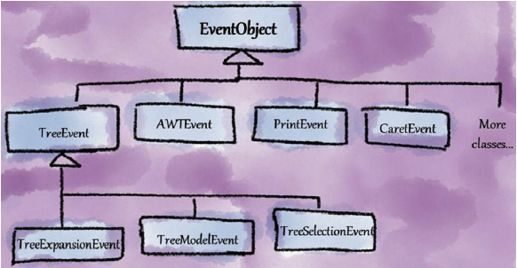

# Wide Hierarchy

<div class="video-wrapper">
<iframe width="560" height="315" src="https://www.youtube.com/embed/7pyZYGDz54w" title="YouTube video player" frameborder="0" allow="accelerometer; autoplay; clipboard-write; encrypted-media; gyroscope; picture-in-picture" allowfullscreen></iframe>
</div>

Smell ini terjadi ketika suatu hierarki inheritance terlalu banyak subclass tanpa disertai dengan adanya intermediate class (alias class penengah) dimana pada kasus ini diindikasikan dengan banyaknya duplikat code di class saudara-saudaranya dan minimnya generalization yang diterapkan. Tanpa/minimnya generalisasi, smell ini bisa menjadi tanda bahaya besar karena smell ini menyangkut:

- Banyaknya duplikat karena adanya harus copy-paste dari subtype lain.
- Minimnya intermediate class memaksakan client untuk memakai subclass langsung yang telah ada sehingga tidak fleksibel dalam pengaplikasian hierarki.

## Penyebab

- **Ignoring generalization**: Developer kurang mengerti seberapa pentingnya generalization dalam hierarki sehingga developer membuatkan subclass langsung dari superclass tanpa mempedulikan adanya perpaduan behaviour yang bisa dipakai oleh subclass lainnya.
- **Lack of refactoring**: Developer malas melakukan refactoring sehingga code dibiarkan *burik-burik/jorok* begitu saja.

## Penyelesaian


Smell wide hierarchy dapat diselesaikan dengan melakukan introduce intermediate class (baik abstract class turunan superclass maupun interface).

## Contoh

## Contoh 1: Kasus class `java.util.EventObject`


Dalam buku Girish, ia menyinggung salah satu hierarki class bernama `java.util.EventObject` dimana pada class tersebut terdapat banyak turunan dimana salah satu tiga subclass yang mempunyai penamaan behaviour yang mirip yaitu `TreeExpansionEvent`, `TreeModelEvent`, dan `TreeSelectionEvent`.



Smell ketiga subclass tersebut kemudian diselesaikan dengan melakukan introduce intermediate class bernama `TreeEvent` dimana class ini merupakan subclass dari `EventObject` dan superclass dari ketiga class tersebut yang berisikan behaviour dari tree.

## Contoh 2: Kasus game environment Tree dan Stone

Sebaliknya pada kasus game environment (package <github-url to="before)">before</github-url>, terdapat 2 subclass dari [GameObject.java](GameObject.java) yaitu [Tree.java](Tree.java) dan [Stone.java](Stone.java) yang mempunyai salah satu method yang behaviournya mirip yaitu `destroy()`. Kedua subclass tersebut seharusnya mempunyai intermediate class yang berperan atas object-object seperti pohon dan batu yaitu `Environment`.

```java
public class Stone extends GameObject {
  public void destroy() {
    //drop barang
  }
  //...
}

public class Tree extends GameObject {
  public void destroy() {
    //drop barang
  }
  //...
}
```

Sebagai jalan penyelesaiannya, class [Environment.java](Environment.java) dibuat untuk menyelesaikan smell wide hierarchy dikarenakan adanya kemiripan behaviour dari class `Stone` dan `Tree` dengan menghadirkan abstract method `destroy()` untuk diaplikasikan pada `Stone` dan `Tree` dan class tersebut berbasiskan dari class `GameObject` sehingga ketika ada class lain yang dibuat mempunyai behaviour yang mirip dengan tree dan stone dapat diextend dari abstract class `Environment` sehingga tidak perlu extend lagi dari `GameObject`-nya.

## Julukan

- **Wide inheritance hierarchy**: This smell occurs when a superclass has more than four direct subclasses.
- **Missing levels of abstraction**: This smell occurs when levels of class abstraction are missing (in other words, more expansion of levels is needed near the root of the hierarchy).
- **Coarse hierarchies**: This smell occurs when a hierarchy has large number of members in a few classes instead of spreading the members among a set of intermediate ancestor classes.
- **Getting away from abstraction**: This smell occurs when number of operations added by a subclass is very high suggesting that some intermediate classes between the subclass and its superclass could be missing.

## When to Ignore

Kedua adalah kasus pemakaian `interface` di Java/C# untuk keperluan protokol generic seperti serialization yang dapat dipakai oleh class-class lain sehingga tidak dianggap memiliki smell Wide Hierarchy.
