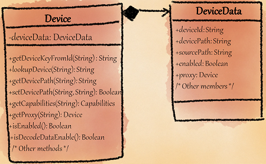
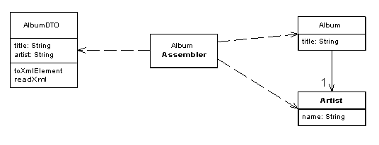

# Broken Modularization

<iframe width="560" height="315" src="https://www.youtube.com/embed/0aeIbhESMco" title="YouTube video player" frameborder="0" allow="accelerometer; autoplay; clipboard-write; encrypted-media; gyroscope; picture-in-picture" allowfullscreen></iframe>

Smell ini terjadi jika pada data member, field, atau method yang seharusnya dikumpulkan dalam 1 class/abstraksi malah terpisah dan tersebar di abstraksi lain. Smell ini sering dimanifestasikan sebagai:

- Class yang hanya menampung data tapi tidak ada method yang memperlakukan data/berinteraksi dalam class. Smell ini disamaratakan dengan [Data Class](../../../martin-fowler/dispensables/data-class/).
- Method yang senang bermain dengan member lain di class lain. Smell ini disamaratakan dengan [Feature Envy](../../../martin-fowler/couplers/feature-envy/).

## Penyebab

- **Procedural thinking in object-oriented languages**: Disebabkan karena developer procedural programming languages mengasumsikan bahwa data harus dipisahkan dari function-function yang memproses data tersebut sehingga dalam OOP, developer memecahkannya ke class terpisah.
- **Lack of knowledge of existing design**: Dalam beberapa kasus terutama dalam perusahaan besar, terdapat banyak class yang seharusnya dapat developer kerjakan selain dari bagian yang ia kerjakan. Hal itu kurang diketahui olehnya sehingga developer menempatkan member/method pada lokasi yang kurang tepat yang pada akhirnya menimbulkan smell tersebut.

## Penyelesaian

Cara paling mudahnya dalam menyelesaikan smell ini adalah dengan memindahkan member-member dari kelas yang terpisah ke class asal-nya. Jika kasus tersebut terjadi pada:

- Method class tersebut sering dipakai oleh class lain, pindahkan method class tersebut ke dalam method class pemakainya dengan ["move field"](https://refactoring.guru/move-field).
- Member class tersebut sering dipakai oleh class lain, pindahkan member class tersebut ke dalam member class pemakainya dengan ["move method"](https://refactoring.guru/move-method).

## Contoh

## Masalah

Terdapat dua class dalam kasus yaitu <github-url to="before/DeviceData.java">Device.java](before/Device.java) dan [DeviceData.java</github-url>. Pada kasus tersebut, member-member dari `Device` dipisahkan ke class lain yang bernama `DeviceData`, dimana method-method dari `Device` akan memanggil data-data dari class `DeviceData`. Hal ini seharusnya tidak boleh dilakukan dalam OOP dikarenakan class seharusnya menampung semua method dan member yang mempunyai tanggungjawab yang sama.

Kasus inilah yang pada akhirnya menimbulkan smell **Broken Modularization** karena adanya perpecahan modul yang memiliki tanggungjawab yang sama dari kelas seharusnya.

## Penyelesaian

Untuk menyelesaikan kasus smell tersebut, gabungkan field dan method menjadi 1 class sehingga class Device dapat menampung method, member, dan field sesuai tanggungjawabnya masing-masing. Pada class <github-url to="after/Device.java">Device.java</github-url>, semua member pindahan dari `DeviceData` ditampung sebagai private member dari `Device`.

## When to Ignore

## Auto-generated code
Jika code tersebut digenerate secara otomatis dari generator (dari higher-level models, terdiri atas beberapa data class), maka hal tersebut memang dapat diabaikan karena dapat menimbulkan efek *out of sync* jika user melakukan modifikasi pada auto-generated codes. Contoh kasusnya adalah [GUI Builder](https://en.wikipedia.org/wiki/Graphical_user_interface_builder) ataupun [LinQ database modeling](https://docs.microsoft.com/en-us/dotnet/csharp/programming-guide/concepts/linq/).

## Data Transfer Objects (DTOs)

Martin Fowler mendefinisikan [Data Transfer Objects](https://martinfowler.com/eaaCatalog/dataTransferObject.html) tersebut sebagai perantara data terhadap [Remote Facade](https://martinfowler.com/eaaCatalog/remoteFacade.html) (aksesor data). Jika class tersebut merupakan class yang difungsikan untuk parsing data dari/ke API website, dimana class tersebut hanya berisikan data field, setter-getter, parser (JSON/XML/AJAX ke Object), dan serializer tanpa method dan behaviour lainnya. Pada kasus tersebut, smell dapat diabaikan demi alasan mempermudah proses transfer data ke network.
